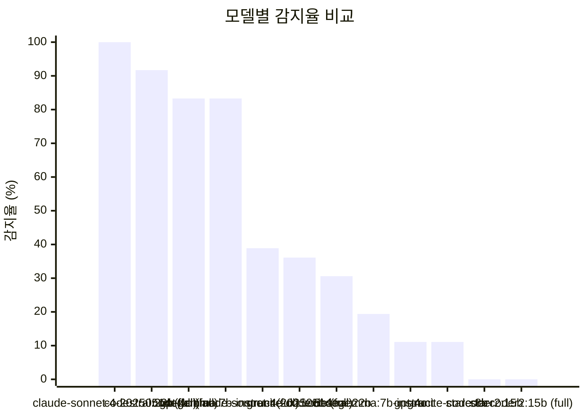
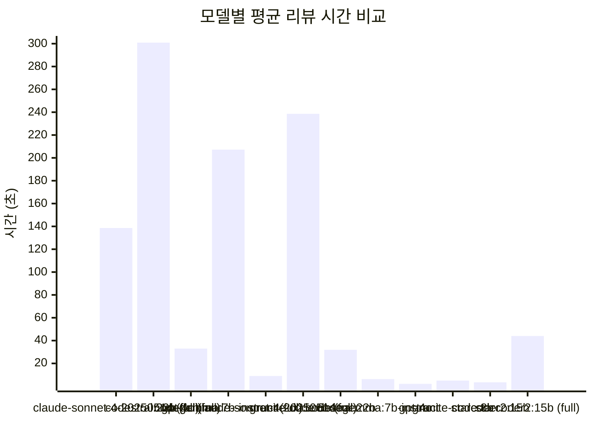

# LLM 코드 리뷰 벤치마크 리포트

> 오프라인(Ollama) 모델과 클라우드(GPT-4o, Claude) 모델의 코드 리뷰 성능 비교 결과입니다.

## 1. 개요

- **벤치마크 생성일**: 2026-04-09 14:32 UTC
- **총 실행 수**: 36
- **모델 수**: 12 (8 Offline / 4 Cloud)
- **테스트 diff 수**: 3

### 테스트 환경

| 구분 | 모델 |
| --- | --- |
| Offline (Ollama) | `codegemma:7b-instruct` |
| Offline (Ollama) | `codegemma:7b-instruct (full)` |
| Offline (Ollama) | `codestral:22b` |
| Offline (Ollama) | `codestral:22b (full)` |
| Offline (Ollama) | `granite-code:8b` |
| Offline (Ollama) | `granite-code:8b (full)` |
| Offline (Ollama) | `starcoder2:15b` |
| Offline (Ollama) | `starcoder2:15b (full)` |
| Cloud (API) | `claude-sonnet-4-20250514` |
| Cloud (API) | `claude-sonnet-4-20250514 (full)` |
| Cloud (API) | `gpt-4o` |
| Cloud (API) | `gpt-4o (full)` |

### 테스트 Diff

| 파일명 | 레이블 |
| --- | --- |
| `ecommerce-platform.diff` | ecommerce (Java/Security) |
| `sample.diff` | sample (Python) |
| `springboot-ddd.diff` | springboot (Java/DDD) |

## 2. 모델별 종합 성능 비교

| 모델 | 유형 | 평균 시간 | 감지율 | JSON 파싱률 | 평균 코멘트 | 총 토큰 | 총 비용 |
| --- | --- | ---: | ---: | ---: | ---: | ---: | ---: |
| `claude-sonnet-4-20250514 (full)` | Cloud | 138.6s | 100.0% | 100.0% | 81.7 | 78607 | $0.5635 |
| `codestral:22b (full)` | Offline | 300.9s | 91.7% | 100.0% | 29.0 | - | - |
| `gpt-4o (full)` | Cloud | 33.0s | 83.3% | 100.0% | 24.7 | 41441 | $0.1462 |
| `codegemma:7b-instruct (full)` | Offline | 207.2s | 83.3% | 66.7% | 40.3 | - | - |
| `claude-sonnet-4-20250514` | Cloud | 9.0s | 38.9% | 100.0% | 5.3 | 5231 | $0.0365 |
| `granite-code:8b (full)` | Offline | 238.6s | 36.1% | 0.0% | 34.3 | - | - |
| `codestral:22b` | Offline | 31.9s | 30.6% | 100.0% | 2.7 | - | - |
| `codegemma:7b-instruct` | Offline | 6.3s | 19.4% | 100.0% | 2.0 | - | - |
| `gpt-4o` | Cloud | 2.1s | 11.1% | 66.7% | 0.7 | 1715 | $0.0053 |
| `granite-code:8b` | Offline | 5.0s | 11.1% | 33.3% | 0.7 | - | - |
| `starcoder2:15b` | Offline | 3.5s | 0.0% | 0.0% | 0.0 | - | - |
| `starcoder2:15b (full)` | Offline | 44.0s | 0.0% | 0.0% | 0.0 | - | - |

## 3. Diff 별 성능 비교

### ecommerce (Java/Security) (`ecommerce-platform.diff`, 1055 lines)

| 모델 | 시간(s) | 코멘트 수 | 감지율 | 감지 이슈 | 미감지 이슈 |
| --- | ---: | ---: | ---: | --- | --- |
| `gpt-4o (full)` | 67.0 | 55 | 100.0% | 하드코딩 비밀번호, MD5 취약한 해시, SQL 인젝션, JWT 시크릿 하드코딩 | - |
| `claude-sonnet-4-20250514 (full)` | 260.0 | 160 | 100.0% | 하드코딩 비밀번호, MD5 취약한 해시, SQL 인젝션, JWT 시크릿 하드코딩 | - |
| `codegemma:7b-instruct (full)` | 198.3 | 71 | 100.0% | 하드코딩 비밀번호, MD5 취약한 해시, SQL 인젝션, JWT 시크릿 하드코딩 | - |
| `codestral:22b (full)` | 508.2 | 49 | 100.0% | 하드코딩 비밀번호, MD5 취약한 해시, SQL 인젝션, JWT 시크릿 하드코딩 | - |
| `claude-sonnet-4-20250514` | 12.6 | 7 | 25.0% | JWT 시크릿 하드코딩 | 하드코딩 비밀번호, MD5 취약한 해시, SQL 인젝션 |
| `granite-code:8b (full)` | 482.6 | 53 | 25.0% | 하드코딩 비밀번호 | MD5 취약한 해시, SQL 인젝션, JWT 시크릿 하드코딩 |
| `gpt-4o` | 1.4 | 0 | 0.0% | - | 하드코딩 비밀번호, MD5 취약한 해시, SQL 인젝션, JWT 시크릿 하드코딩 |
| `codegemma:7b-instruct` | 6.1 | 2 | 0.0% | - | 하드코딩 비밀번호, MD5 취약한 해시, SQL 인젝션, JWT 시크릿 하드코딩 |
| `codestral:22b` | 19.3 | 2 | 0.0% | - | 하드코딩 비밀번호, MD5 취약한 해시, SQL 인젝션, JWT 시크릿 하드코딩 |
| `granite-code:8b` | 4.2 | 0 | 0.0% | - | 하드코딩 비밀번호, MD5 취약한 해시, SQL 인젝션, JWT 시크릿 하드코딩 |
| `starcoder2:15b` | 3.3 | 0 | 0.0% | - | 하드코딩 비밀번호, MD5 취약한 해시, SQL 인젝션, JWT 시크릿 하드코딩 |
| `starcoder2:15b (full)` | 82.8 | 0 | 0.0% | - | 하드코딩 비밀번호, MD5 취약한 해시, SQL 인젝션, JWT 시크릿 하드코딩 |

### sample (Python) (`sample.diff`, 74 lines)

| 모델 | 시간(s) | 코멘트 수 | 감지율 | 감지 이슈 | 미감지 이슈 |
| --- | ---: | ---: | ---: | --- | --- |
| `gpt-4o (full)` | 10.6 | 8 | 100.0% | 하드코딩 비밀번호, SQL 인젝션, 빈 except 절 | - |
| `claude-sonnet-4-20250514 (full)` | 34.8 | 15 | 100.0% | 하드코딩 비밀번호, SQL 인젝션, 빈 except 절 | - |
| `codegemma:7b-instruct (full)` | 29.2 | 13 | 100.0% | 하드코딩 비밀번호, SQL 인젝션, 빈 except 절 | - |
| `codestral:22b (full)` | 86.4 | 10 | 100.0% | 하드코딩 비밀번호, SQL 인젝션, 빈 except 절 | - |
| `claude-sonnet-4-20250514` | 6.0 | 4 | 66.7% | 하드코딩 비밀번호, 빈 except 절 | SQL 인젝션 |
| `codestral:22b` | 17.4 | 2 | 66.7% | 하드코딩 비밀번호, 빈 except 절 | SQL 인젝션 |
| `gpt-4o` | 3.4 | 2 | 33.3% | 하드코딩 비밀번호 | SQL 인젝션, 빈 except 절 |
| `codegemma:7b-instruct` | 6.2 | 2 | 33.3% | 하드코딩 비밀번호 | SQL 인젝션, 빈 except 절 |
| `granite-code:8b` | 7.7 | 2 | 33.3% | 빈 except 절 | 하드코딩 비밀번호, SQL 인젝션 |
| `granite-code:8b (full)` | 68.6 | 16 | 33.3% | SQL 인젝션 | 하드코딩 비밀번호, 빈 except 절 |
| `starcoder2:15b` | 2.9 | 0 | 0.0% | - | 하드코딩 비밀번호, SQL 인젝션, 빈 except 절 |
| `starcoder2:15b (full)` | 10.1 | 0 | 0.0% | - | 하드코딩 비밀번호, SQL 인젝션, 빈 except 절 |

### springboot (Java/DDD) (`springboot-ddd.diff`, 570 lines)

| 모델 | 시간(s) | 코멘트 수 | 감지율 | 감지 이슈 | 미감지 이슈 |
| --- | ---: | ---: | ---: | --- | --- |
| `claude-sonnet-4-20250514 (full)` | 121.0 | 70 | 100.0% | 도메인 레이어 의존성 위반, 트랜잭션 처리 누락, N+1 쿼리 문제, 예외 처리 미흡 | - |
| `codestral:22b (full)` | 307.9 | 28 | 75.0% | 도메인 레이어 의존성 위반, N+1 쿼리 문제, 예외 처리 미흡 | 트랜잭션 처리 누락 |
| `gpt-4o (full)` | 21.3 | 11 | 50.0% | 도메인 레이어 의존성 위반, 예외 처리 미흡 | 트랜잭션 처리 누락, N+1 쿼리 문제 |
| `codegemma:7b-instruct (full)` | 393.9 | 37 | 50.0% | 도메인 레이어 의존성 위반, 예외 처리 미흡 | 트랜잭션 처리 누락, N+1 쿼리 문제 |
| `granite-code:8b (full)` | 164.6 | 34 | 50.0% | 도메인 레이어 의존성 위반, 예외 처리 미흡 | 트랜잭션 처리 누락, N+1 쿼리 문제 |
| `claude-sonnet-4-20250514` | 8.4 | 5 | 25.0% | 도메인 레이어 의존성 위반 | 트랜잭션 처리 누락, N+1 쿼리 문제, 예외 처리 미흡 |
| `codegemma:7b-instruct` | 6.4 | 2 | 25.0% | 도메인 레이어 의존성 위반 | 트랜잭션 처리 누락, N+1 쿼리 문제, 예외 처리 미흡 |
| `codestral:22b` | 59.0 | 4 | 25.0% | 도메인 레이어 의존성 위반 | 트랜잭션 처리 누락, N+1 쿼리 문제, 예외 처리 미흡 |
| `gpt-4o` | 1.6 | 0 | 0.0% | - | 도메인 레이어 의존성 위반, 트랜잭션 처리 누락, N+1 쿼리 문제, 예외 처리 미흡 |
| `granite-code:8b` | 3.3 | 0 | 0.0% | - | 도메인 레이어 의존성 위반, 트랜잭션 처리 누락, N+1 쿼리 문제, 예외 처리 미흡 |
| `starcoder2:15b` | 4.2 | 0 | 0.0% | - | 도메인 레이어 의존성 위반, 트랜잭션 처리 누락, N+1 쿼리 문제, 예외 처리 미흡 |
| `starcoder2:15b (full)` | 39.3 | 0 | 0.0% | - | 도메인 레이어 의존성 위반, 트랜잭션 처리 누락, N+1 쿼리 문제, 예외 처리 미흡 |

## 4. Offline vs Cloud 비교

| 항목 | Offline (Ollama) | Cloud (API) |
| --- | ---: | ---: |
| 실행 수 | 24 | 12 |
| 평균 리뷰 시간 | 104.7s | 45.7s |
| 평균 감지율 | 34.0% | 58.3% |
| 총 비용 | - | $0.7514 |

## 5. 토큰 소모량 분석 (Cloud)

| 모델 | Diff | Input Tokens | Output Tokens | Total | 비용(USD) |
| --- | --- | ---: | ---: | ---: | ---: |
| `claude-sonnet-4-20250514` | ecommerce (Java/Security) | 1,249 | 793 | 2,042 | $0.0156 |
| `claude-sonnet-4-20250514` | sample (Python) | 856 | 361 | 1,217 | $0.0080 |
| `claude-sonnet-4-20250514` | springboot (Java/DDD) | 1,392 | 580 | 1,972 | $0.0129 |
| `claude-sonnet-4-20250514 (full)` | ecommerce (Java/Security) | 31,027 | 18,002 | 49,029 | $0.3631 |
| `claude-sonnet-4-20250514 (full)` | sample (Python) | 4,916 | 1,508 | 6,424 | $0.0374 |
| `claude-sonnet-4-20250514 (full)` | springboot (Java/DDD) | 15,360 | 7,794 | 23,154 | $0.1630 |
| `gpt-4o` | ecommerce (Java/Security) | 0 | 0 | 0 | $0.0000 |
| `gpt-4o` | sample (Python) | 590 | 124 | 714 | $0.0027 |
| `gpt-4o` | springboot (Java/DDD) | 996 | 5 | 1,001 | $0.0025 |
| `gpt-4o (full)` | ecommerce (Java/Security) | 21,544 | 4,290 | 25,834 | $0.0968 |
| `gpt-4o (full)` | sample (Python) | 3,413 | 504 | 3,917 | $0.0136 |
| `gpt-4o (full)` | springboot (Java/DDD) | 10,804 | 886 | 11,690 | $0.0359 |
| **합계** | - | **92,147** | **34,847** | **126,994** | **$0.7514** |

## 6. 시각화 차트

### 감지율 비교

### 평균 리뷰 시간 비교

